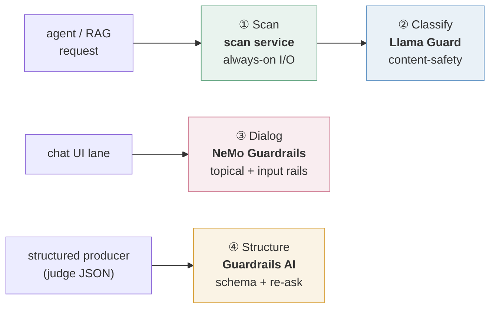

# Defense-in-Depth Guardrails: Four Complementary Layers for LLM Applications

No single guardrail catches everything. A prompt-injection scanner says nothing about whether an answer is _on-topic_; a topical rail says nothing about whether a JSON blob _matches its schema_; none of them classify _content safety_ the way a purpose-trained model does. The robust pattern is to run **four complementary, industry-standard tools**, each doing one job, composed as **defense-in-depth** — the same pattern production stacks use (most run two or three of these). They are **complementary, not competing**. Every layer below has a mature open-source, self-hostable option, so the whole stack can be assembled at no licensing cost.

---

## The four layers

| #   | Layer         | Representative tooling                                                                                                  | The one job it does                                                                                               | Where it sits                                                                                                          |
| --- | ------------- | ----------------------------------------------------------------------------------------------------------------------- | ----------------------------------------------------------------------------------------------------------------- | ---------------------------------------------------------------------------------------------------------------------- |
| ①   | **Scan**      | a thin in-house scan service composing **Prompt Guard 2** (injection) · **Presidio** (PII) · an **NLI** grounding check | fast **I/O sanitization** — injection · PII · grounding · action-policy (content safety is delegated to Classify) | the always-on first layer, at the agent edge and the tool gateway                                                      |
| ②   | **Classify**  | **Llama Guard** (Meta)                                                                                                  | model-based **content-safety classification** (safe / unsafe + category)                                          | a classifier the Scan layer calls — **a ~1B model on CPU** by default, **a ~8B model on on-demand GPU** for escalation |
| ③   | **Dialog**    | **NeMo Guardrails** (NVIDIA)                                                                                            | **topical / conversational** control — keep the assistant in scope                                                | wrapping the chat surface as a dedicated guarded chat model                                                            |
| ④   | **Structure** | **Guardrails AI**                                                                                                       | **output-schema validation** — validate + **re-ask** the model to repair                                          | structured-output producers (e.g. an LLM-as-judge emitting JSON)                                                       |

A note on the Scan layer: it is deliberately described as _composed_ rather than as a single product. Off-the-shelf all-in-one scanners exist, but they bundle a fixed set of detectors on a fixed release cadence. Assembling the layer from a few focused, independently-maintained components — an injection classifier, a PII engine, a grounding check — means any one of them can be swapped without re-architecting the layer. That property matters more than it sounds; see the closing section.

---

## How they compose

Each guard runs on the surface where it earns its keep — not every layer on every request.

- **Scan** is the always-on baseline every agent request passes through (fire-and-forget shadow mode → near-zero added latency).
- **Classify** is the model-based second opinion the Scan layer can call — the small model answers by default; the larger one is spun up on GPU only when a heavier verdict is wanted.
- **Dialog** wraps only the **conversational** surface — a dedicated guarded chat model, so general chat stays unguarded.
- **Structure** wraps only **structured-output** producers — where a malformed blob silently breaks a downstream consumer.

Alongside these sit **pre-action authorization** (a confirm step plus an enforcing policy gate before any state-changing action) and **offline evaluation** (an LLM-judge quality lane) — the act-safety and quality lanes that complete the picture.

---

## Why four tools, not one

Each addresses a **distinct failure mode** a single tool can't:

- **Scan** stops the _input/output_ attacks and leaks (injection, PII) — fast, on every request.
- **Classify** catches _content-policy_ violations a keyword or embedding scanner misses (weapons, self-harm, CSAM, toxicity) with a model trained for exactly that — and grades them by category. **Worked example:** given the same dangerous request, the ~1B safety model binned it as _violent crime_, while the ~8B binned it more precisely as _indiscriminate weapons_. The sharper classification is exactly why the stronger escalation tier is worth having.
- **Dialog** keeps a _conversation_ in scope — refuse off-domain requests, resist jailbreaks — which the stateless I/O scanners have no notion of.
- **Structure** guarantees a _machine-readable contract_ — valid JSON matching a schema, re-generated on failure — so a producer's output can't silently corrupt what reads it.

A useful consequence of the split: **content safety belongs in Classify, not Scan.** It is tempting to let the fast scanner own a toxicity detector too, since it is already inspecting every request. Resist it. Toxicity is a content-policy judgment, and a purpose-trained classifier grades it by category where a scanner returns an undifferentiated score. Consolidating it into Classify removes a redundant model from the hot path and puts the judgment where it can actually be reasoned about.

---

## Engineering realities (the honest part)

- **Fail-open, everywhere.** Every guard degrades to "not guarded", never "no answer" — a guard outage must never take a response offline. Ship verdicts in **shadow (record-only) mode first**, and measure the false-positive rate on real traffic _before_ promoting anything to hard-block. (Fail-open is the right default for an assistant surface; a product with a genuine duty of care to vulnerable users should weigh this differently.)
- **Dependency isolation forces separate services.** Classify, Structure, and Dialog often cannot co-install with a data/ML stack. Guardrails AI pins an old `click` that is irreconcilable with common orchestration and ML tooling, and NeMo's dependency tree is just as opinionated. Run each as its **own** service. The tools' _dependency politics_ dictate the architecture as much as any design argument does.
- **The reliable primitive beats the elegant one.** NeMo's signature domain-specific rail language (Colang) would not fire — across two builds and an earlier standalone trial. The fix was to route topicality through the **`self check input`** LLM-judge rail that _does_ fire, with a custom refusal message for identical UX. When an elegant primitive won't cooperate after honest attempts, switching to the proven-but-plainer one is the engineering call.
- **Assume any given tool will be retired.** This stack has already replaced its original all-in-one Scan tool after that project was archived upstream — swapping in a dedicated injection classifier and a dedicated PII engine in its place. The four _layers_ proved durable; one of the four _tools_ did not last two years. Name your layers by the job they do, keep each one swappable, and treat a vendor's maintenance signal as a design input rather than an afterthought.

---

## Takeaway

Treat guardrails like security layers, not a single gate: pick the smallest set of complementary tools that together cover your real failure modes (input/output attacks, content policy, topical scope, output structure), run each where it earns its keep, fail open, and roll out in shadow before you enforce. Bind the architecture to the four jobs, not to the four product names — the jobs will outlive the tools.
